# NYC Taxi Fare Prediction Web App README
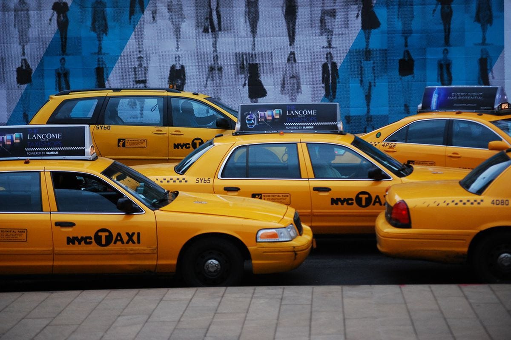

Welcome to the NYC Taxi Fare Prediction Web App! This Streamlit application provides an interactive and user-friendly interface for predicting taxi fares in New York City based on various input parameters. Whether you're a commuter, traveler, or just curious about taxi fares, this app offers insights and predictions using a trained machine learning model.

## Features

- Dataset Exploration: In the Dataset section, you can explore both the original and transformed datasets used for training the machine learning model. Visualizations and summaries of key dataset attributes help you understand the data that powers the predictions.
- Data Description: Description section provides detailed descriptions of the dataset, offering insights into the columns, data types, and statistics.
- Data Transformation: In the Transformation section, you can visualize the data transformation process. Step-by-step visualizations showcase data preprocessing and feature engineering techniques that contribute to the accuracy of the model.
- Exploratory Graphs: The "Graphs" section offers a range of exploratory graphs that provide valuable insights into the data. From distribution plots to scatter plots, these visuals help you understand the relationships between different variables.
- Geographic Insights: Explore pickup and dropoff locations using interactive maps in the "Maps" section. Visualize the geographic distribution of taxi rides and gain insights into the busiest areas and trends.
- Fare Prediction:Predict taxi fares using the "Model" section. Input parameters such as passenger count, year, month, and distance to receive an estimated taxi fare. The app leverages an XGBoost machine learning model to provide accurate predictions.
## Prerequisites

Make sure you have the following dependencies installed:

- Python 3.x
- pandas==1.3.0
- numpy==1.21.0
- matplotlib==3.4.2
- folium==0.12.1
- scikit-learn==0.24.2
- seaborn==0.11.1
- streamlit==0.88.0
- Pillow==8.2.0

You can install these dependencies using the following command:

```bash
pip install -r requirements.txt
```

## Usage

1. Clone the repository:

```bash
git clone https://github.com/nanihemanth/New-York-Taxi-Fare-Prediction
cd New-York-Taxi-Fare-Prediction
```

2. Make sure you have the pickle file(run the model with xgboost and save the pickle file for prediction)

3. Run the Streamlit app:

```bash
streamlit run  app.py
```

4. Open your web browser and navigate to `http://localhost:8501` to access the NYC Taxi Fare Prediction Web App .

## Model

The prediction model used in this app is an XGBoost model trained on New York City taxi fare data. The trained model is loaded using a saved pickle file (xgboost_haversine_model.pkl).


## Output Images

After entering the inputs(number of passengers,distance,year), the app will predict the estimated fare.
	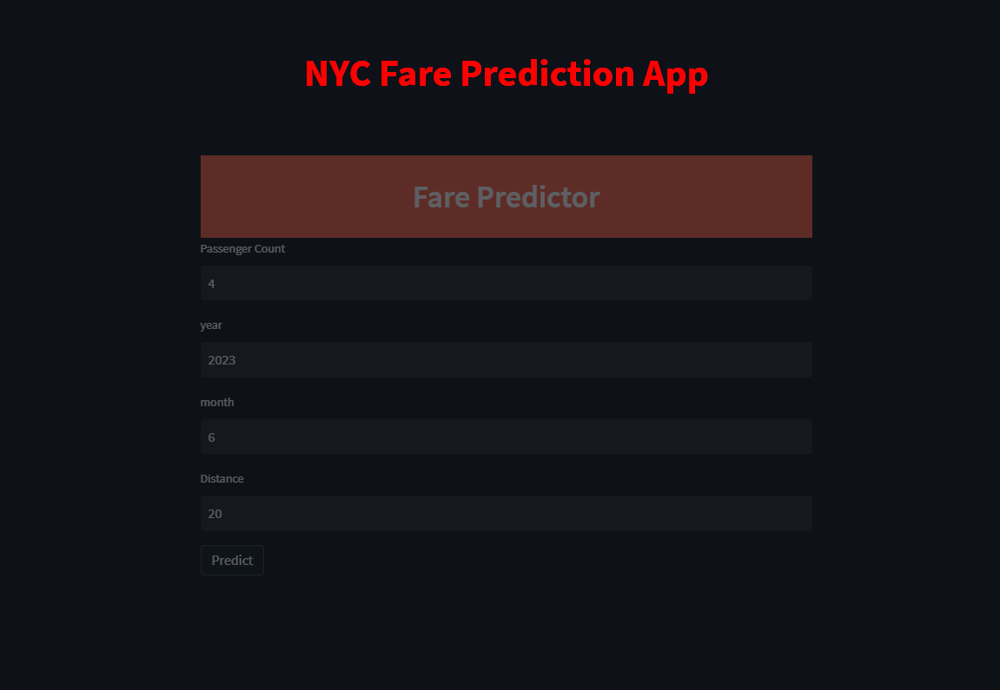


## Visualization

- Count Plot for the number of taxi rides for each passenger-count
	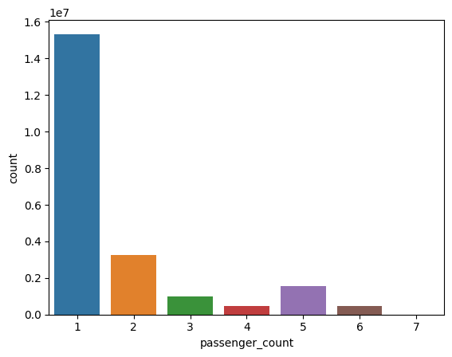

- Count Plot for the number of taxi rides for each shift
	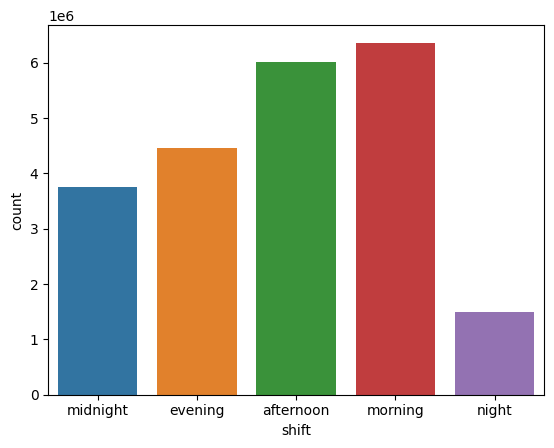

- Count plot for the number of taxi rides in each year
	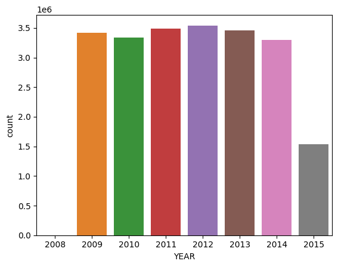

- Count plot for the number of taxi rides in each year and shift
    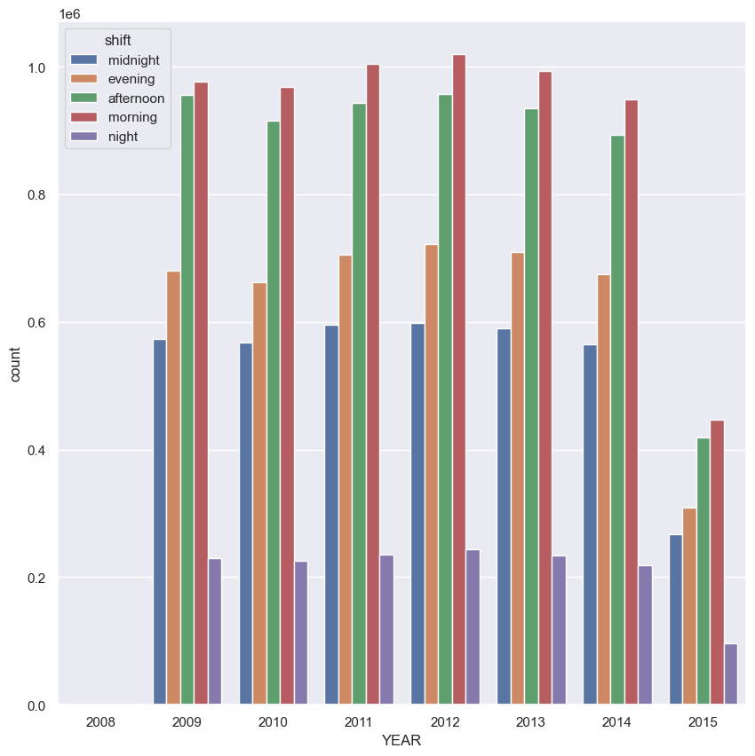

- Count plot for the number of taxi rides in each year and type
    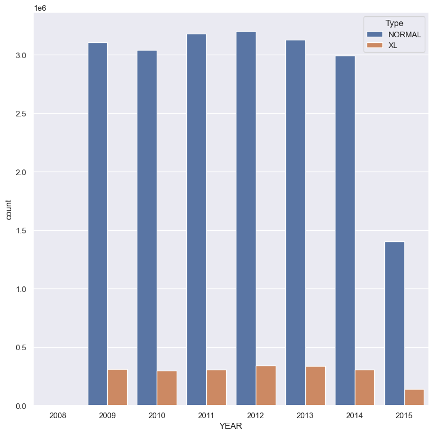

- Trends in total average amount vs YEAR,MONTH,DAY,HOUR
	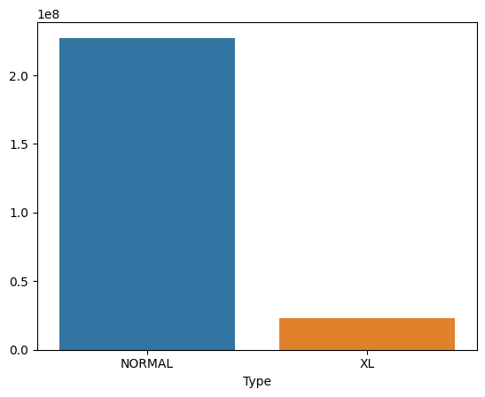

- Line plot for total average amount and each shift
	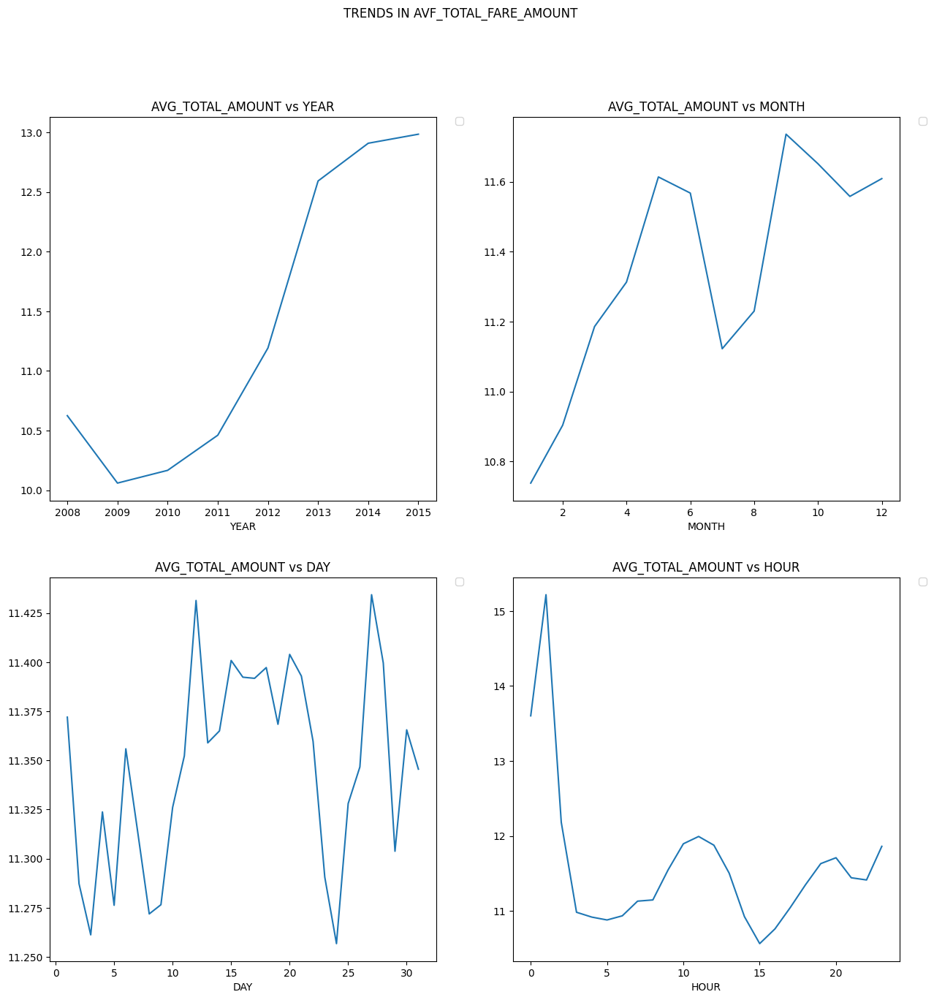

- Pick up Points
	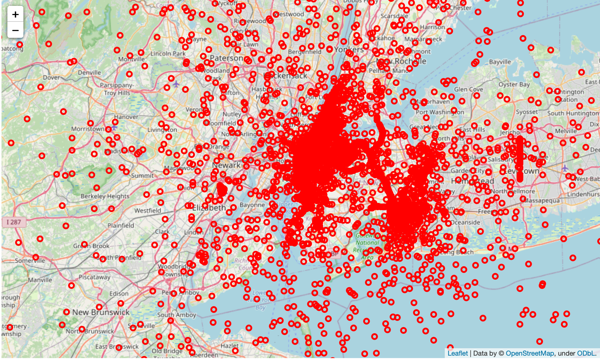

- Drop off  Points
	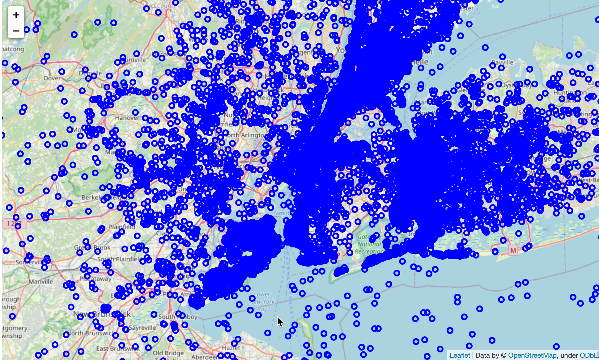

## Results

- RMSE and R2-score
	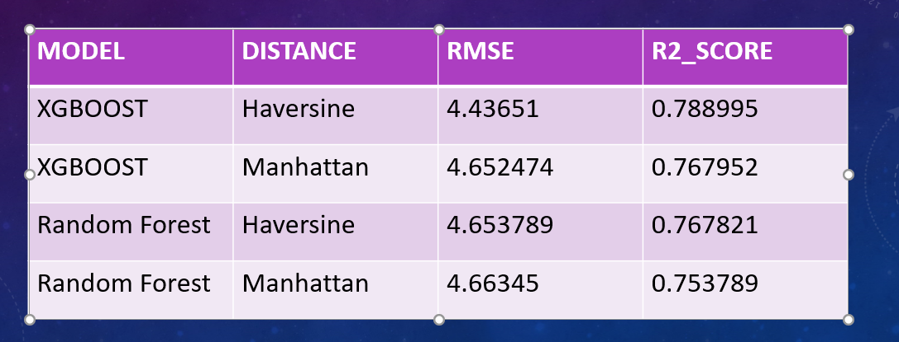


## App Structure

The app is organized into different sections for easy navigation:

- `Dataset`: View the original and transformed datasets used for training the model.
- `Description`: Explore dataset descriptions and relevant insights.
- `Transformation`: Visualize data transformation steps.
- `Graphs`:  View graphical representations of data analysis.
- `Maps:` See pickup and dropoff points on interactive maps.
- `Model:` Input passenger count, year, month, and distance to predict taxi fare.


## Contributing

Contributions to the NYC Taxi Fare Prediction Web App are welcome. If you encounter any bugs, have suggestions for improvements, or want to add new features, please open an issue or submit a pull request to the repository.

## License

This project is licensed under the [GPL-v3](LICENSE).

